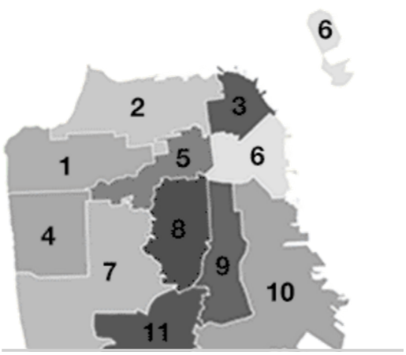

```{r setup, include=FALSE}
knitr::opts_chunk$set(echo = FALSE)
library(knitr)
library(tidyverse)
library(networkD3)
library(forcats)
```

---


---


---


---

```{r, echo = F, warning = F, message = F}
FinalImage <- read_csv("FinalImage.csv")
kable(head(FinalImage))
```

---

```{r, echo = F, eval = F, warning = F, message = F}
District1Results <- read_csv("District1Results.csv") %>%
  select(2,3,5,7,9,11,13,15,17,19,20)
kable(District1Results)
```


---

```{r echo = F, warning = F}
source <- c(13, 14, 15, 16, 17, 18, 19, 20, 21, 22, 23, 10, 10, 10, 10, 10, 10, 10, 10, 10, 10, 9, 9, 9, 9, 9, 9, 9, 9, 9, 8, 8, 8, 8, 8, 8, 8, 8, 7, 7, 7, 7, 7, 7, 7, 6, 6, 6, 6, 6, 6, 5, 5, 5, 5, 5, 4, 4, 4, 4, 3, 3, 3, 13, 14, 23, 24)
target <- c(1, 2, 3, 4, 5, 6, 7, 8, 9, 10, 11, 1, 2, 3, 4, 5, 6, 7, 8, 9, 12, 1, 2, 3, 4, 5, 6, 7, 8, 12, 1, 2, 3, 4, 5, 6, 7, 12, 1, 2, 3, 4, 5, 6, 12, 1, 2, 3, 4, 5, 12, 1, 2, 3, 4, 12, 1, 2, 3, 12, 1, 2, 12, 24, 24, 24, 10)
value <- c(12550, 11067, 3396, 974, 747, 740, 609, 611, 557, 359, 3499, 139, 68, 12, 10, 26, 4, 43, 15, 9, 23, 88, 113, 82, 58, 62, 17, 28, 29, 52, 68, 108, 70, 81, 70, 27, 52, 55, 221, 167, 77, 61, 71, 32, 48, 67, 205, 242, 130, 56, 56, 164, 201, 121, 142, 90, 162, 312, 159, 147, 1554, 1175, 492, 0, 0, 0, 0)
name <-  c("Voters", "Fewer", "Philhour", "Lee", "Greenberg", "Larkin", "Kwong", "Lyens", "Jungreis", "D'Silva", "Thornley", "N/A", "Exhausted", "Fewer", "Philhour", "Lee", "Greenberg", "Larkin", "Kwong", "Lyens", "Jungreis", "D'Silva", "Thornley", "N/A", ".")
sankey_d1_values <- data.frame(source, target, value)
sankey_d1_nodes <- data.frame(name)

sankeyNetwork(Links = sankey_d1_values, Nodes = sankey_d1_nodes, Source = "source", Target = "target", Value = "value", NodeID = "name", units = "voters", fontSize = 12, nodeWidth = 20)
```

---

```{r, echo = F, cache = T, message = F}
BallotImage <- read_tsv("data/20161206_ballotimage.txt", col_names = F) %>%
  separate(X1, c("contest_id",
                 "pref_voter_id",
                 "serial_number",
                 "tally_type_id",
                 "precinct_id",
                 "vote_rank",
                 "candidate_id",
                 "over_vote",
                 "under_vote"),
           sep = c(7,16,23,26,33,36,43,44)) %>%
  mutate(tally_type_id = as.integer(tally_type_id),
         vote_rank = factor(vote_rank,
                            ordered = T,
                            levels = c("001","002","003")),
         vote_rank = fct_recode(vote_rank,
                                "1" = "001",
                                "2" = "002",
                                "3" = "003"),
         over_vote = as.integer(over_vote),
         under_vote = as.integer(under_vote))

MasterLookup <- read_tsv("data/20161206_masterlookup.txt", col_names = F) %>%
  separate(X1, c("record_type",
                 "id",
                 "description",
                 "list_order",
                 "candidates_contest_id",
                 "is_writein",
                 "is_provisional"),
           sep = c(10,17,67,74,81,82)) %>%
  mutate(record_type = trimws(record_type),
         description = trimws(description),
         is_writein = as.integer(is_writein),
         is_provisional = as.integer(is_provisional))

Candidates <- MasterLookup %>%
  filter(record_type == "Candidate") %>%
  select(id, description) %>%
  rename(candidate = description)
Contests <- MasterLookup %>%
  filter(record_type == "Contest") %>%
  select(id, description) %>%
  rename(contest = description)
Precincts <- MasterLookup %>%
  filter(record_type == "Precinct") %>%
  select(id, description) %>%
  rename(precinct = description)
Tallies <- MasterLookup %>%
  filter(record_type == "Tally Type") %>%
  select(id, description) %>%
  mutate(id = as.integer(id)) %>%
  rename(tally = description)

BallotImage <- left_join(BallotImage, Candidates, by = c("candidate_id" = "id"))
BallotImage <- left_join(BallotImage, Contests, by = c("contest_id" = "id"))
BallotImage <- left_join(BallotImage, Precincts, by = c("precinct_id" = "id"))
BallotImage <- left_join(BallotImage, Tallies, by = c("tally_type_id" = "id"))

data <- BallotImage %>%
  select(pref_voter_id, precinct, contest, over_vote, under_vote, serial_number) %>%
  group_by(pref_voter_id) %>%
  summarise(over = (sum(over_vote) != 0),
            under = (sum(under_vote) != 0),
            precinct = unique(precinct),
            contest = unique(contest),
            serial_number = unique(serial_number))

PrecinctData <- data %>%
  group_by(precinct) %>%
  summarise(p_over = mean(over),
            p_under = mean(under),
            contest = unique(contest))

ggplot(PrecinctData, aes(x = p_over, y = p_under, col = contest)) +
  geom_point()
```

---

```{r, echo = F}
SmallerData <- data %>%
  filter(!(contest %in% c("Board of Supervisors, District 3",
                          "Board of Supervisors, District 5"))) %>%
  group_by(precinct) %>%
  summarise(p_over = mean(over),
            p_under = mean(under),
            contest = unique(contest))

ggplot(SmallerData, aes(x = p_over, y = p_under, col = contest)) +
  geom_point() +
  geom_smooth(method = lm, se = F, aes(col = contest))
```

---

